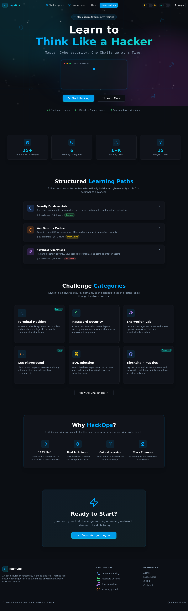
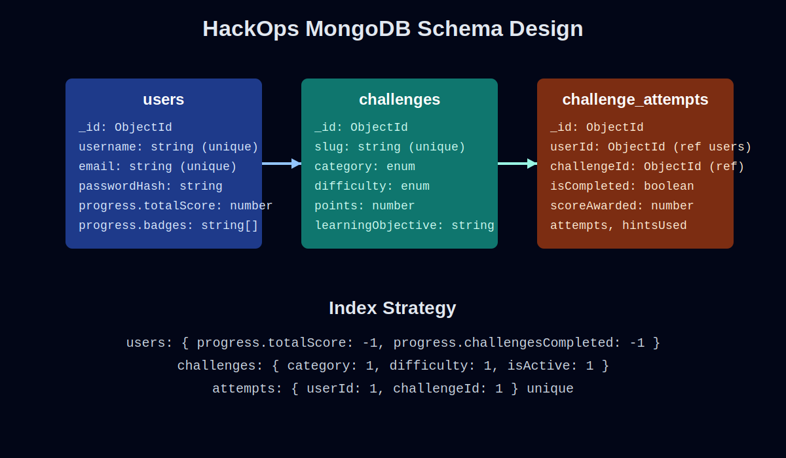
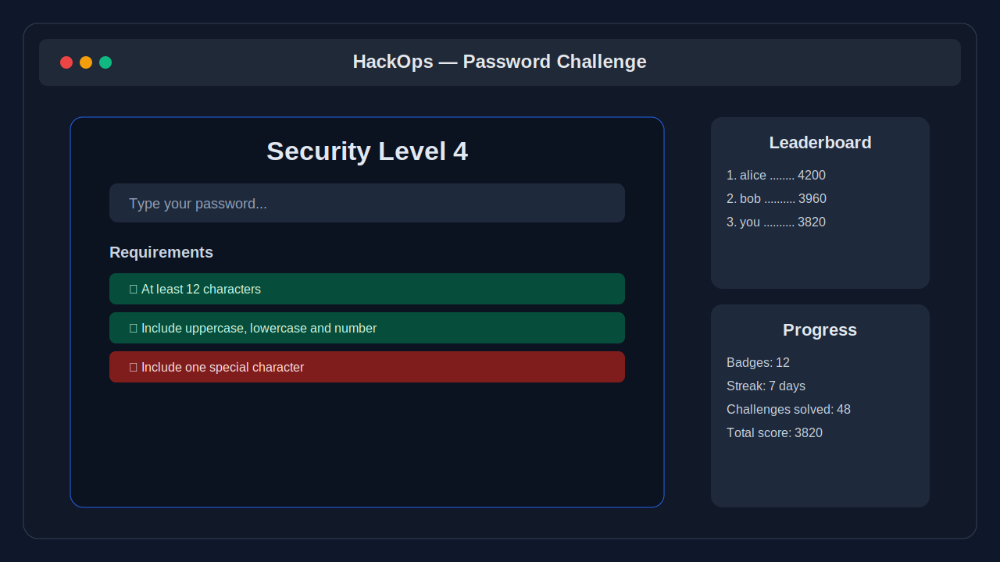

# HackOps — Gamified Cybersecurity Learning Platform

HackOps is an interactive learning platform that teaches practical cybersecurity concepts through game-like challenges, scoring, progression, hints, and leaderboard-ready user progress.

> **Resume-ready stack:** React + Node.js + MongoDB (with an additional existing FastAPI backend still available in this repository).

---

## Project Preview






---

## Why this project matters

HackOps demonstrates how to build a **capacity-building cybersecurity product** that can support real learners at scale:

- **Gamification loop:** challenges → attempts → score → progression → badges
- **Efficient data modeling:** MongoDB schemas and indexes designed for leaderboard and progress retrieval
- **Production-minded backend:** auth, secure middleware, structured API modules, and environment-based configuration
- **Modern frontend:** React + Vite challenge experience

---

## Architecture

### Frontend
- React 18 + TypeScript + Vite
- UI-driven challenge modules (e.g., Password Challenge)
- Existing frontend tests under `frontend/src/components/PasswordGame/__tests__`

### Node.js Backend (new)
Location: `/backend-node`

- Express API with security middleware (`helmet`, `cors`)
- JWT authentication (`jsonwebtoken`)
- Password hashing (`bcryptjs`)
- MongoDB ODM (`mongoose`)
- Modular structure:
  - `src/models` → MongoDB schemas
  - `src/routes` → auth, challenges, progress, health
  - `src/middleware` → JWT guard
  - `src/config` → env + DB setup

### Existing Python Backend (legacy in repo)
Location: `/backend`

- FastAPI + Motor (MongoDB async client)
- Large API surface and legacy tests under `/tests`

---

## MongoDB Schema Design (Node backend)

### `users`
Stores identity + game progression:
- `username`, `email` (unique)
- `passwordHash`
- `progress.totalScore`, `progress.challengesCompleted`, `progress.badges`, `progress.streakDays`

### `challenges`
Stores challenge catalog:
- `slug` (unique)
- `category` (password, terminal, xss, sql_injection, encryption, blockchain)
- `difficulty`, `points`, `learningObjective`, `isActive`

### `challenge_attempts`
Tracks user performance:
- `userId` + `challengeId` (unique pair)
- `isCompleted`, `scoreAwarded`, `attempts`, `hintsUsed`, `completedAt`

### Performance indexes
- Leaderboard retrieval: `users.progress.totalScore`, `users.progress.challengesCompleted`
- Catalog filters: `challenges.category`, `challenges.difficulty`, `challenges.isActive`
- Attempt lookups: `challenge_attempts.userId`, `challenge_attempts.challengeId`

---

## Quick Start

## 1) Frontend (React)

```bash
cd /home/runner/work/HackOps/HackOps/frontend
npm install
npm run dev
```

App starts on `http://localhost:3000` (or Vite default if configured differently).

## 2) Node backend (recommended for React + Node + Mongo stack)

```bash
cd /home/runner/work/HackOps/HackOps/backend-node
cp .env.example .env
# update JWT_SECRET and MONGODB_URI in .env
npm install
npm run start
```

API starts on `http://localhost:4000`.

### Core endpoints
- `GET /api/health`
- `POST /api/auth/register`
- `POST /api/auth/login`
- `GET /api/challenges`
- `GET /api/progress/me` (requires Bearer token)

## 3) Existing FastAPI backend (legacy)

```bash
cd /home/runner/work/HackOps/HackOps/backend
pip install -r requirements.txt
python server.py
```

---

## Testing

### Node backend tests

```bash
cd /home/runner/work/HackOps/HackOps/backend-node
npm test
```

Includes contract tests for:
- Health endpoint success
- Auth payload validation
- JWT-protected route unauthorized behavior

### Existing frontend/backend tests
- Frontend component tests: `frontend/src/components/PasswordGame/__tests__`
- Legacy backend tests: `tests/backend_test.py`

---

## Production-readiness notes

- Environment-driven config (`.env`)
- JWT-based auth boundary for user progress routes
- Password hashing via bcrypt
- MongoDB indexing for low-latency reads on challenge and leaderboard workflows
- Modular API code layout for maintainability and team scaling

---

## How to explain this project to a hiring manager / recruiter

Use this concise narrative:

1. **Problem solved**
   - “I built a gamified cybersecurity learning platform to make security education hands-on and engaging.”

2. **Stack and ownership**
   - “Frontend is React; backend is Node.js/Express with MongoDB; I designed the schema and API modules.”

3. **Engineering depth**
   - “I modeled user progress, challenge metadata, and attempts for efficient retrieval and leaderboard-like queries using indexes.”

4. **Security + production approach**
   - “I used JWT auth, hashed passwords, and security middleware, with clean environment configuration and modular services.”

5. **Impact framing**
   - “The architecture is designed to support 500+ learners with fast challenge retrieval and progress tracking workflows.”

If asked what’s hardest technically, discuss:
- balancing schema flexibility with query performance,
- defining stable auth boundaries,
- and keeping game logic responsive while preserving backend consistency.

---

## License

MIT
